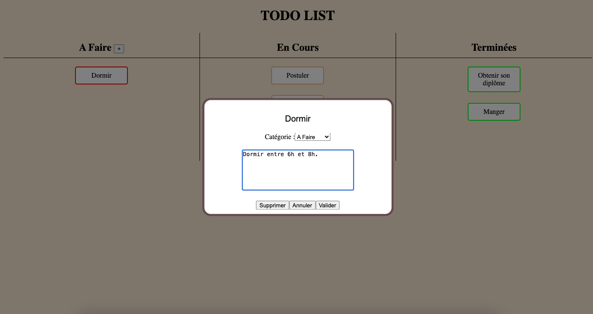

# TO-DO LIST Kanban

Permet d'oganiser ses tâches en utilisant 3 colonnes : à faire, en cours et terminées.

###
Il est possible de modifier les tâches ainsi que d'ajouter une description.

## Run the project

This project was bootstrapped with [Create React App](https://github.com/facebook/create-react-app).

In the project directory, you can run:

### `yarn start`

Runs the app in the development mode.\
Open [http://localhost:3000](http://localhost:3000) to view it in your browser.